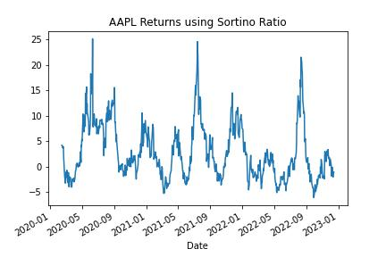

# Sortino Ratio
Measure your risk-adjusted returns with the Sortino ratio which is a popular performance metric to measure risk

The Sortino ratio tells you the risk-adjusted return of an investment. It is similar to the Sharpe ratio except it only considers “downside deviation”. In other words, it only uses the asset’s standard deviation of negative returns. Investors consider it a better measure of an asset’s risk-adjusted performance since positive volatility is a benefit.

If you’re investing or trading, you might want to consider the Sortino ratio as one of your performance metrics.

**Without considering the Sortino ratio, you miss important information about the performance.**

Similar to the Sharpe ratio, you can use the Sortino ratio to compare investments.

For example:

- Stock A returns 30% with 20% volatility and 30% downside deviation
- Stock B returns 20% with 13% volatility and 15% downside deviation
Which is the better investment?

Both stocks have the same Sharpe ratios. Stock B’s return is lower but so is the downside deviation. That means stock A has more volatility in its negative returns and is riskier than stock B. The Sortino ratio captures this dynamic.

Key takeaways:

- Get stock price data
- Compute the Sortino ratio
- Compute downside deviation
- Compare two investment options

---

Import the libaries:
Yfinance
NumPy
Matplotlib

---

**File:** [Sortino Ratio](SortinoRatio.ipynb)

---

## Step 1: Get the data

Use the yFinance library to get data

For this example we will work with the SPY and AAPL adjusted closing price using the built in pct_change() function

---

## Step 2: Compute the Sortino Ratio

Create a function for the Sortino ratio
- compute annualized return
- compute the downside deviation

The function takes a series of daily returns and subtracts an adjustment factor. Some investors use this to measure the return over the risk-free rate. Since the risk free-rate has been near 0 for almost a decade, it is not considered in the analysis. Finally, take the average return and annualize it.

To compute downside deviation, I use numpys clip function. The clip returns the numbers in an array between two values. Take the negative returns by using negative infinity and 0. Then find the standard deviation of the negative returns and annualize it.

The Sortino ratio is the average annualized return divided by the annualized downside deviation.

**A note on downside deviation**

"Risk" usually refers to the volatility of an asset. That’s because the higher the volatility the higher the uncertainty of where the price will be when you want to sell the asset. When most people think of risk, they usually think of how much money they might lose. Downside deviation attempts to capture the "money-losing" part of the asset volatility.

## Step 3: Compare investment options

Compute the Sortino ratio for AAPL and SPY.

**Sortino Ratio for SPY**

**Sortino Ratio for AAPL**

The Sortino ratio for AAPL is higher than for SPY. That means you have more return for every unit of downside risk.

It’s always useful to look at performance metrics through time because they are never static.

**Rolling SPY returns**

**Rolling AAPL returns**

Use a histogram to visualize the distribution of rolling Sortino ratios. 

**SPY historgram**

**AAPL historgram**

In the case of AAPL, there is a long tail of positive Sortino ratios.

Let’s see how the Sortino ratios of AAPL and SPY compare through time. Was AAPL always a better risk adjusted return?

**Subtract the SPY Sortino ratio from the AAPL Sortino ratio and plot the result as a histogram.**

The histogram looks like two overlapping distributions. One distribution is centered around 0 and looks to be skewed left. The other distribution looks to center around 5 and be more even. This might reflect two different periods of time. One where SPY outperformed AAPL and another where AAPL outperformed SPY.

Without the Sortino ratio, you might miss this important information about performance.
